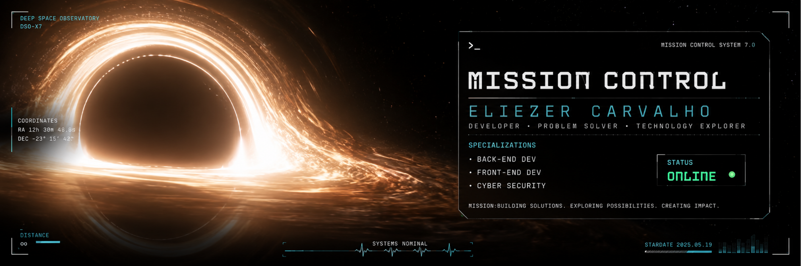

<p align="center">
  
</p>

<p align="center">
  
</p>

---

<p align="center">
  <sub>— <em>Costumávamos olhar para o céu e nos perguntar qual era o nosso lugar nas estrelas. Agora apenas olhamos para baixo.</em> —</sub>
</p>

---

## CREW DOSSIER

<table>
<tr>
<td width="220">
  
</td>
<td>

```
> ENDURANCE :: signal acquired
> identity confirmed :: ELIEZER
> coordinates :: Brazil
> status :: ONLINE
```

Estudante de Sistemas de Informação com foco em desenvolvimento de software,
automação e experiências digitais.

**Current trajectory:**
Construindo sites, aplicações e sistemas escaláveis.

**Mission directive:**
Criar coisas que sobrevivam ao momento em que foram feitas.

</td>
</tr>
</table>

---

## ONBOARD SYSTEMS

<table>
<tr>
<td width="220">
  
</td>
<td>


```
> All systems nominal.
> Relativity noted — time spent building is never wasted.
```

</td>
</tr>
</table>

---

## ACTIVE TRAJECTORIES

<table>
<tr>
<td width="220">
  
</td>
<td>

### Singularity Pages
Landing pages de alta conversão — projetadas para puxar atenção como um buraco negro.

### Personal Portfolio
Experimentos, UI e projetos frontend. Um registro que sobrevive à jornada.

### Future SaaS
Pesquisa e desenvolvimento. A quinta dimensão está em construção.

```
> "A humanidade nasceu na Terra. Nunca foi para ficar."
```

</td>
</tr>
</table>

---

## TELEMETRY

<p align="center">
  
  
</p>

<p align="center">
  
</p>

---

<p align="center">
  <sub>
    <em>O tempo só é um círculo se você parar de se mover. Continue construindo.</em>
  </sub>
</p>

<p align="center">
  <sub>— ENDURANCE :: transmission complete —</sub>
</p>
